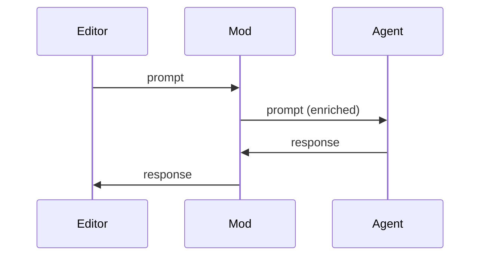
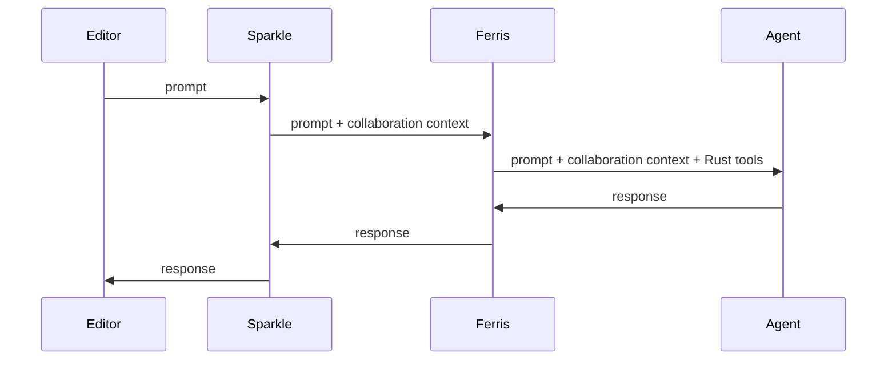

# Agent mods

Agent mods extend what your AI agent can do. A mod sits between your editor and your agent, observing the conversation and enriching it.

## What can a mod do?

Mods are proxies that see every message passing between editor and agent. This lets them:

**Inject context** - Add information to prompts before the agent sees them. A mod could insert the current date, project conventions, or relevant documentation.

**Provide tools** - Give the agent new capabilities. The [Ferris mod](./using/ferris.md) provides tools for fetching Rust crate sources; the [Cargo mod](./using/cargo.md) provides `cargo build` and `cargo test`.

**Transform output** - Modify responses before they reach the editor. A mod could reformat code, add annotations, or filter sensitive information.

**Coordinate behavior** - Manage multi-step workflows, track state across turns, or orchestrate multiple agents.

## Mods you might already know

If you've used **MCP servers**, Symposium can inject them as mods. An MCP server provides tools and resources that the agent can invoke - Symposium wraps it with an adapter that handles the protocol translation.

If you've used **agent skills** (like Claude Code's slash commands), those can also be injected as mods. Skills define prompts and coordinate agent behavior - Symposium adapts them to work with any ACP-compatible agent.

Mods are a superset of both - they can do everything MCP servers and skills can do, plus intercept and transform the conversation itself.

## Composing mods

Multiple mods can chain together. Each mod handles its own concern without needing to know about the others:

This modularity is the key advantage. Mods are interoperable - anyone can write one, and they compose without coordination.

## Built-in and community mods

Symposium ships with [built-in mods](./using/extensions.md) for Rust development. But the ecosystem is open - anyone can [create](./extensions/creating-extensions.md) and [publish](./extensions/publishing-extensions.md) mods, and crate authors can [recommend mods](./extensions/recommending-extensions.md) that help agents use their libraries.
