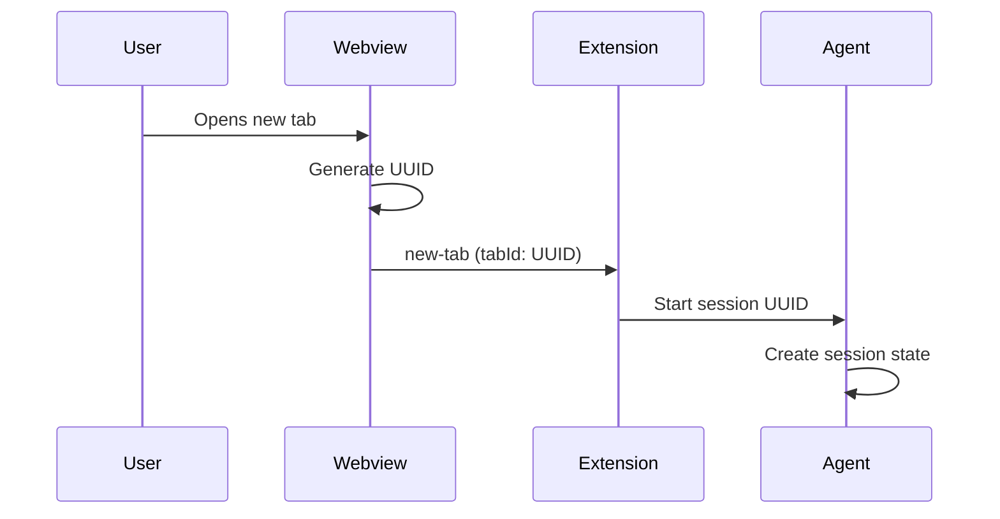
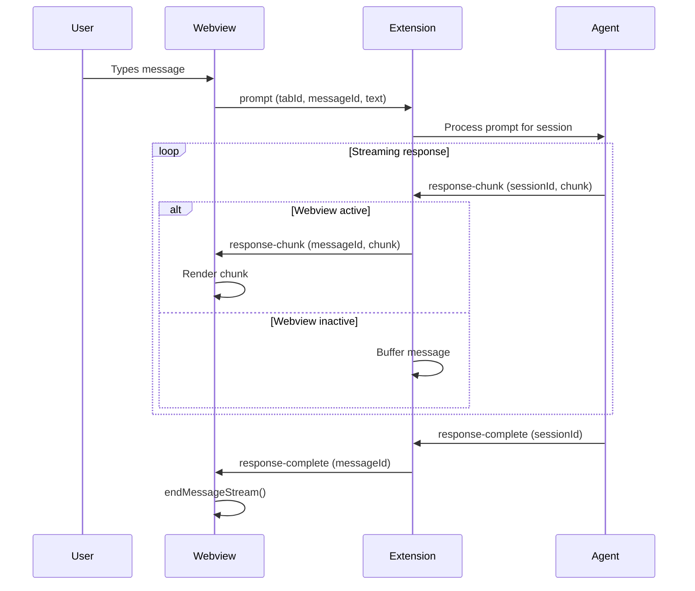
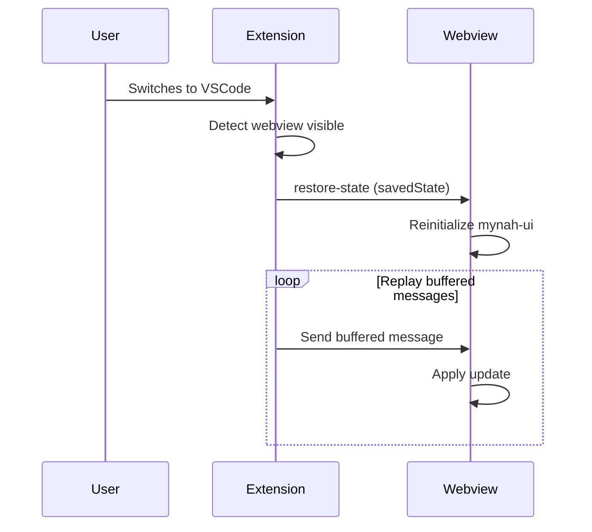
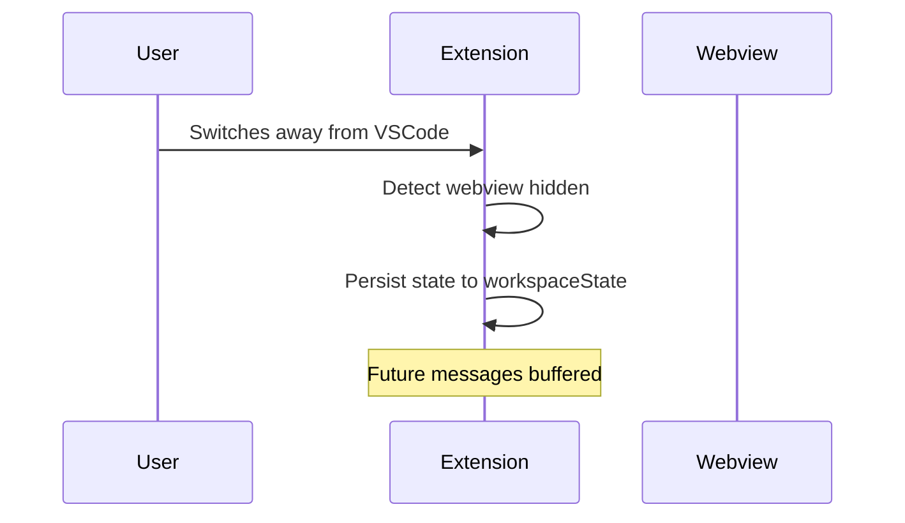

# VSCode Extension Architecture

The Symposium VSCode extension provides a chat interface for interacting with AI agents through a webview-based UI using mynah-ui.

## Architecture Overview

The extension follows a three-layer architecture:

```
┌─────────────────────────────────────────────────┐
│  Webview (Browser Context)                      │
│  - mynah-ui rendering                           │
│  - Tab management                               │
│  - User interaction                             │
└─────────────────┬───────────────────────────────┘
                  │ VSCode postMessage API
┌─────────────────▼───────────────────────────────┐
│  Extension (Node.js Context)                    │
│  - Central message routing                      │
│  - State persistence                            │
│  - Agent lifecycle management                   │
│  - Message buffering                            │
└─────────────────┬───────────────────────────────┘
                  │ Process spawning / IPC
┌─────────────────▼───────────────────────────────┐
│  Agent (Separate Process)                       │
│  - Session management                           │
│  - Streaming response generation                │
│  - ACP protocol implementation                  │
└─────────────────────────────────────────────────┘
```

## Components

### Webview Layer

Runs in a browser context within VSCode's webview panel. Handles UI rendering and user interaction.

**Responsibilities:**
- Render chat interface using mynah-ui
- Generate unique tab IDs using UUIDs
- Capture user input and send to extension
- Display streaming responses from agents
- Serialize UI state for persistence

**Key files:**
- `symposium-webview.ts` - Webview initialization and message handling

### Extension Layer

Runs in Node.js context with full VSCode API access. Acts as central coordinator.

**Responsibilities:**
- Route messages between webview and agents
- Manage singleton agent process
- Map tab IDs to agent sessions
- Handle webview lifecycle (activate/deactivate)
- Buffer messages when webview inactive
- Persist conversation state to workspace storage

**Key files:**
- `extension.ts` - Extension activation and command registration
- `chatViewProvider.ts` - Webview provider and message routing

### Agent Layer

Separate process that handles AI interaction logic.

**Responsibilities:**
- Manage multiple concurrent sessions (one per tab)
- Process prompts and generate responses
- Stream response chunks back to extension
- Implement ACP protocol (future)

**Current implementation:**
- `homerActor.ts` - Placeholder agent that responds with Homer quotes

**Future implementation:**
- Spawn `sacp-conductor` process
- Use ACP protocol for bidirectional communication

## Message Flow

### Opening a New Tab



### Sending a Prompt



### Webview Lifecycle

#### Activation (user switches to VSCode)



#### Deactivation (user switches away)



## State Management

### State Shape

State is represented as mynah-ui's native tab format returned by `mynahUI.getAllTabs()`. The extension treats this as opaque data - it doesn't parse or understand mynah-ui's internal structure.

**Storage location:** VSCode workspace state (`workspaceState.get/update`)

**Persistence timing:**
- After each completed response
- On webview deactivation

**Restoration timing:**
- On webview initialization
- On webview activation after being hidden

### Message Buffering

When webview is inactive, the extension buffers messages instead of sending them.

**Buffered message types:**
- `response-chunk` - Incremental response updates
- `response-complete` - Response stream completion signals

**Buffer strategy:** Simple queue - each message that would have been sent is added to the buffer.

**Replay strategy:** On webview activation, send all buffered messages in order before resuming normal message flow.

## Agent Management

### Singleton Pattern

The extension spawns a single agent process shared across all tabs. This minimizes startup time and resource usage.

**Agent lifecycle:**
- Spawn on extension activation (or lazily on first tab)
- Keep alive for entire VSCode session
- Kill on extension deactivation

### Session Mapping

Each tab corresponds to exactly one agent session.

**Mapping:** `tabId (UUID) → session state`

The agent maintains this mapping internally. The extension only needs to route messages using tab IDs.

**Session lifecycle:**
- Create session when new tab opened
- Keep active while tab open
- Clean up session when tab closed

### Multiple Sessions

While the ACP protocol supports multiple concurrent sessions per agent, the current design uses one session per tab for simplicity.

Future enhancement: Could support multiple sessions per tab, but one-to-one mapping is sufficient for initial implementation.

## Implementation Status

### Current (Homer Actor Phase)

- ✅ Webview with mynah-ui rendering
- ✅ Message passing between webview and extension
- ✅ Streaming response display
- ✅ State persistence and restoration
- ✅ UUID-based message identification
- ⚠️ HomerActor as placeholder agent (per-message instances)
- ⚠️ No explicit tab lifecycle messages
- ⚠️ No agent session management
- ⚠️ No webview activate/deactivate handling
- ⚠️ No message buffering

### Next Phase (Architecture Alignment)

- [ ] Add new-tab lifecycle message
- [ ] Implement singleton agent pattern
- [ ] Add session management to agent
- [ ] Map tab IDs to sessions in extension
- [ ] Implement webview activation detection
- [ ] Add message buffering for inactive webview
- [ ] Add buffer replay on activation

### Future Phase (ACP Integration)

- [ ] Replace HomerActor with sacp-conductor spawn
- [ ] Implement ACP protocol communication
- [ ] Handle bidirectional ACP message flow
- [ ] Support tool calls from agent
- [ ] Integrate with Sparkle MCP server
