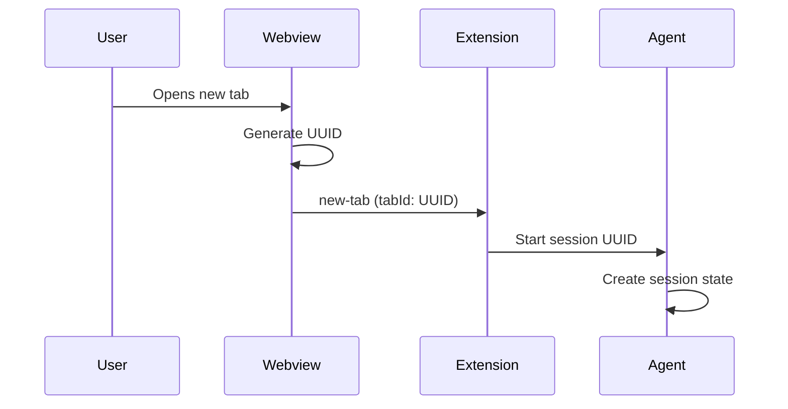
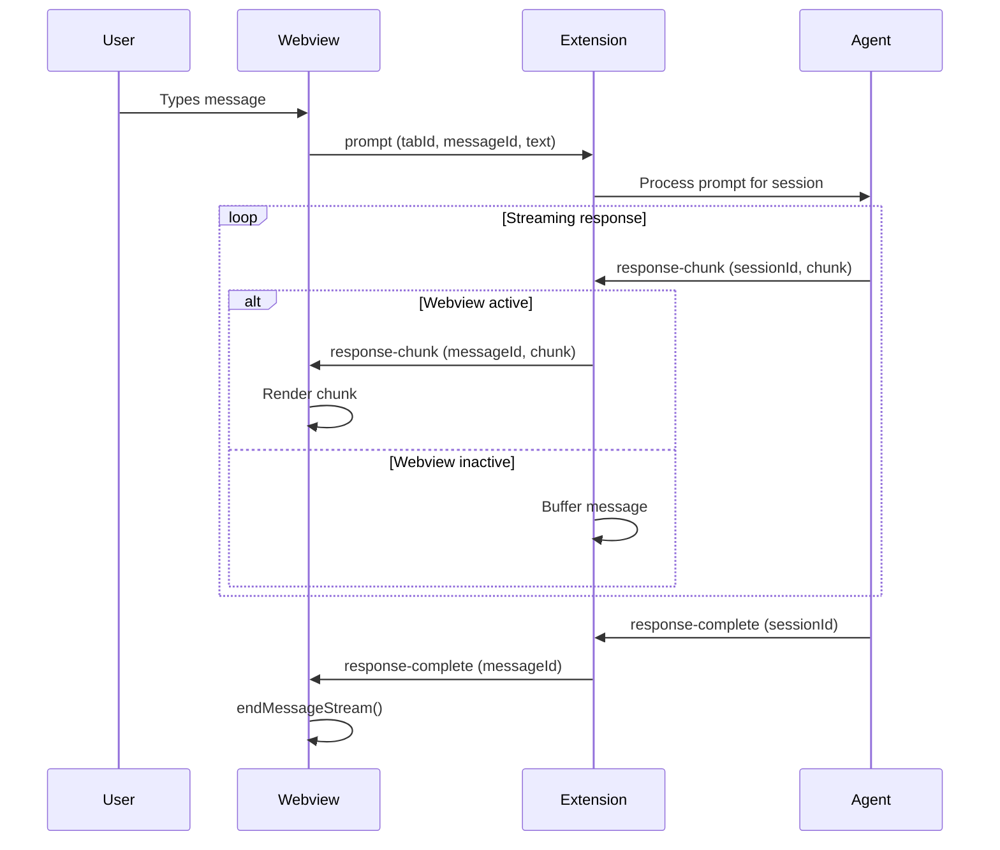
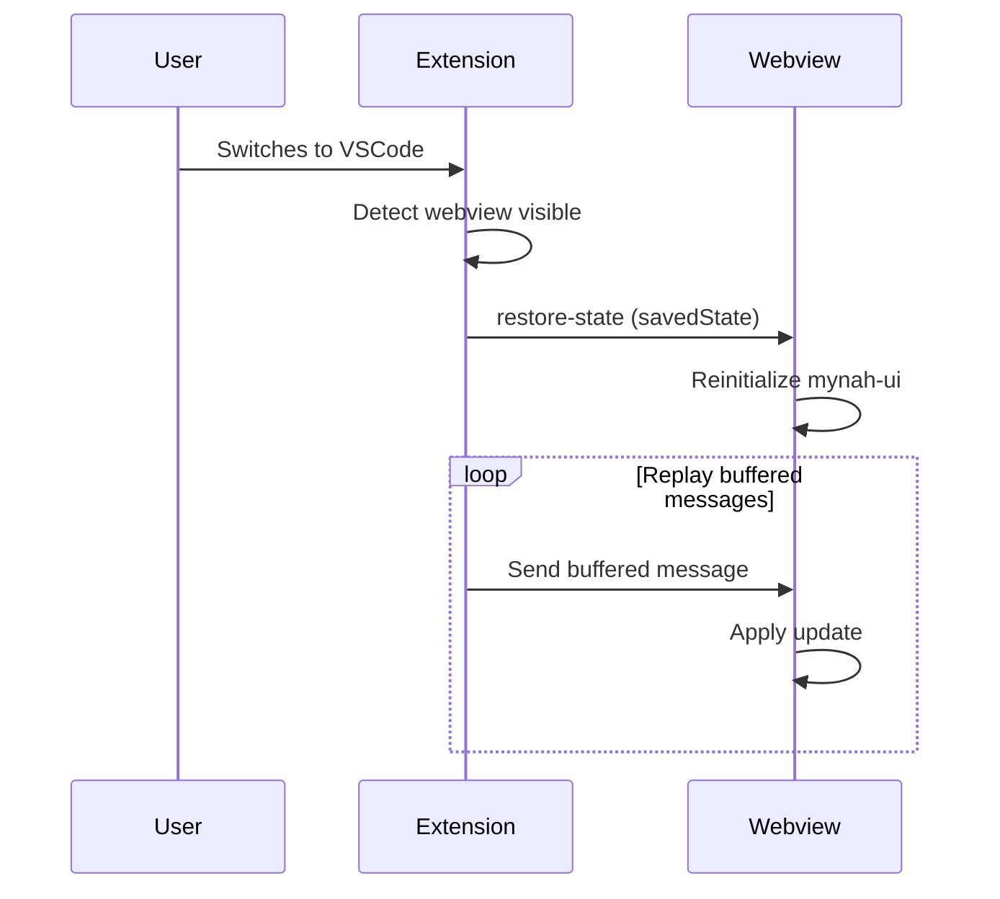
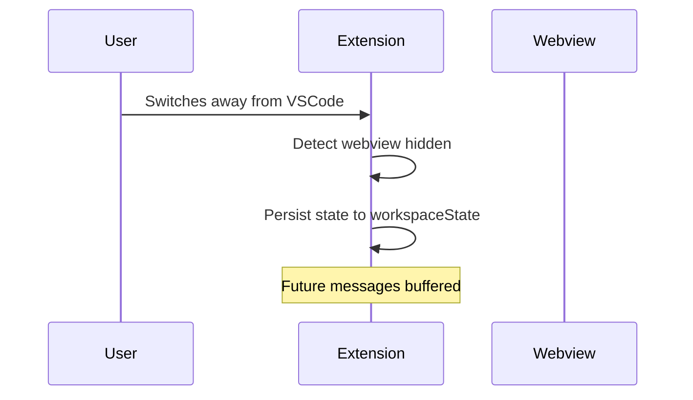
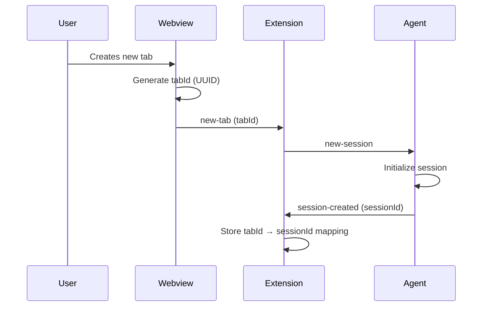
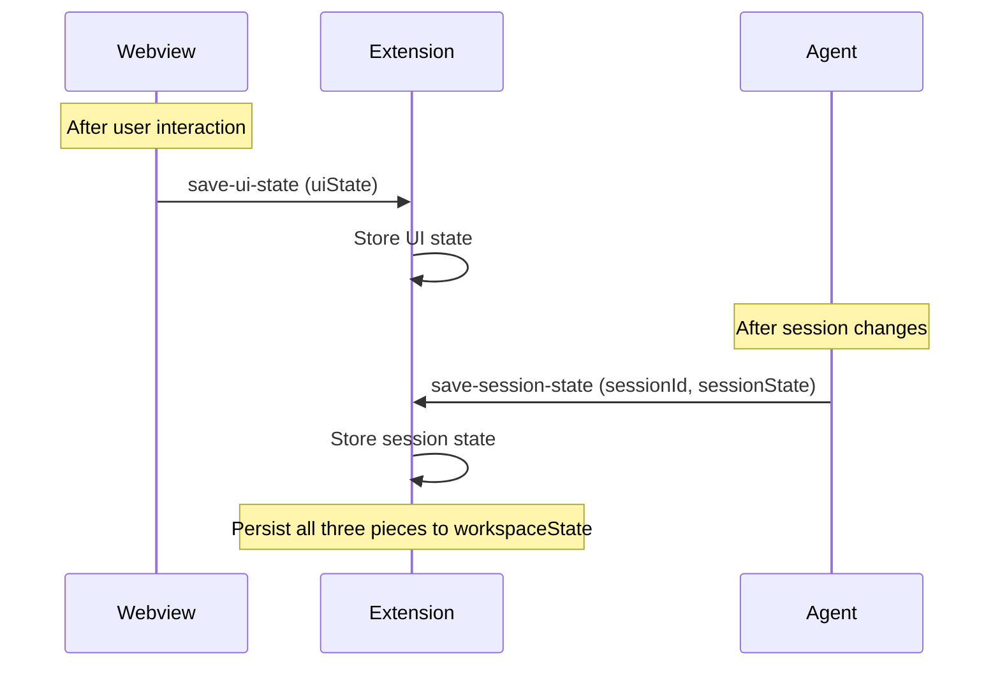
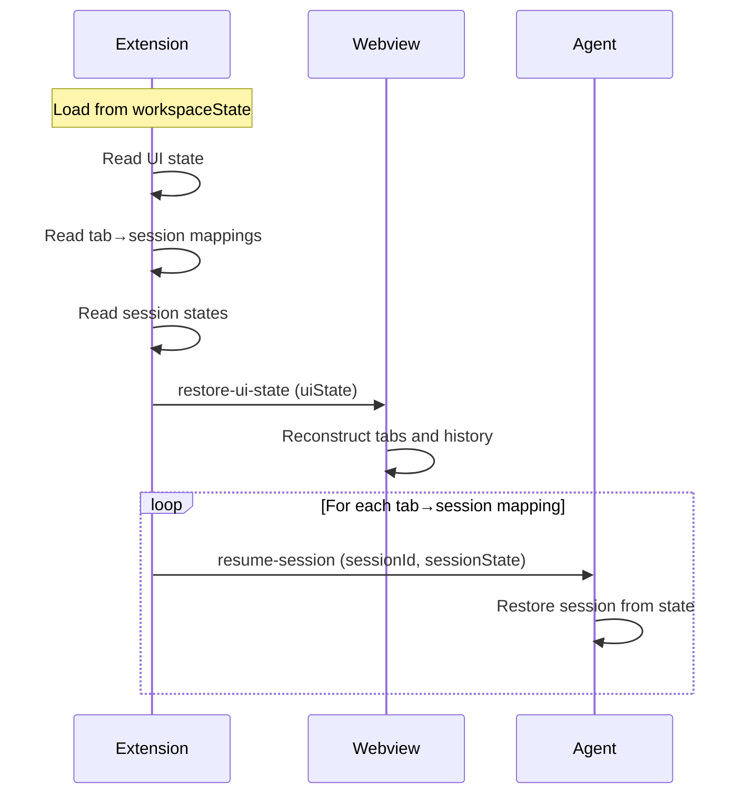

# VSCode Extension Architecture

The Symposium VSCode extension provides a chat interface for interacting with AI agents through a webview-based UI using mynah-ui.

## Architecture Overview

The extension follows a three-layer architecture:

```
┌─────────────────────────────────────────────────┐
│  Webview (Browser Context)                      │
│  - mynah-ui rendering                           │
│  - Tab management                               │
│  - User interaction                             │
└─────────────────┬───────────────────────────────┘
                  │ VSCode postMessage API
┌─────────────────▼───────────────────────────────┐
│  Extension (Node.js Context)                    │
│  - Central message routing                      │
│  - State persistence                            │
│  - Agent lifecycle management                   │
│  - Message buffering                            │
└─────────────────┬───────────────────────────────┘
                  │ Process spawning / IPC
┌─────────────────▼───────────────────────────────┐
│  Agent (Separate Process)                       │
│  - Session management                           │
│  - Streaming response generation                │
│  - ACP protocol implementation                  │
└─────────────────────────────────────────────────┘
```

## Components

### Webview Layer

Runs in a browser context within VSCode's webview panel. Handles UI rendering and user interaction.

**Responsibilities:**
- Render chat interface using mynah-ui
- Generate unique tab IDs using UUIDs
- Capture user input and send to extension
- Display streaming responses from agents
- Serialize UI state for persistence

**Key files:**
- `symposium-webview.ts` - Webview initialization and message handling

### Extension Layer

Runs in Node.js context with full VSCode API access. Acts as central coordinator.

**Responsibilities:**
- Route messages between webview and agents
- Manage singleton agent process
- Map tab IDs to agent sessions
- Handle webview lifecycle (activate/deactivate)
- Buffer messages when webview inactive
- Persist conversation state to workspace storage

**Key files:**
- `extension.ts` - Extension activation and command registration
- `chatViewProvider.ts` - Webview provider and message routing

### Agent Layer

Separate process that handles AI interaction logic.

**Responsibilities:**
- Manage multiple concurrent sessions (one per tab)
- Process prompts and generate responses
- Stream response chunks back to extension
- Implement ACP protocol (future)

**Current implementation:**
- `homerActor.ts` - Placeholder agent that responds with Homer quotes

**Future implementation:**
- Spawn `sacp-conductor` process
- Use ACP protocol for bidirectional communication

## Message Flow

### Opening a New Tab



### Sending a Prompt



### Webview Lifecycle

#### Activation (user switches to VSCode)



#### Deactivation (user switches away)



## State Management

The extension coordinates three independent pieces of state, treating each as opaque data owned by its respective component.

### Three-Part State Model

**1. UI State**
- Owned by: mynah-ui webview
- Format: Whatever `mynahUI.getAllTabs()` returns
- Contains: Tab structure, chat history, UI configuration
- Extension role: Store and restore, don't parse

**2. Tab-to-Session Mapping**
- Owned by: Extension
- Format: `{ [tabId: string]: sessionId: string }`
- Contains: Which agent session corresponds to which UI tab
- Extension role: Maintain mapping, coordinate between UI and agent

**3. Session State**
- Owned by: Agent
- Format: Agent-specific (opaque to extension)
- Contains: Session-specific data (for Homer: quote index; for ACP: conversation context)
- Extension role: Store per-session, pass back to agent on resume

### State Lifecycle

#### Creating a New Tab



#### Saving State



#### Restoring State (on VSCode restart)



### Storage Format

```typescript
{
  "uiState": <opaque blob from mynah-ui>,
  "sessions": {
    "tab-uuid-1": {
      "sessionId": "session-uuid-1",
      "state": <opaque blob from agent>
    },
    "tab-uuid-2": {
      "sessionId": "session-uuid-2", 
      "state": <opaque blob from agent>
    }
  }
}
```

**Storage location:** VSCode workspace state (`workspaceState.get/update`)

**Key principle:** Each component owns its state format. Extension coordinates but doesn't understand the details.

### Message Buffering

When webview is inactive, the extension buffers messages instead of sending them.

**Buffered message types:**
- `response-chunk` - Incremental response updates
- `response-complete` - Response stream completion signals

**Buffer strategy:** Simple queue - each message that would have been sent is added to the buffer.

**Replay strategy:** On webview activation, send all buffered messages in order before resuming normal message flow.

## Agent Management

### Agent Responsibilities

The agent manages session state and responds to extension requests. Each agent maintains multiple concurrent sessions.

**Agent interface:**
- `new-session` → creates new session, returns `sessionId`
- `resume-session (sessionId, state)` → restores session from saved state
- `process-prompt (sessionId, prompt)` → generates streaming response
- `save-session-state (sessionId)` → sends current session state to extension

**Agent owns:**
- Session ID generation
- Session state format
- Session-specific logic

**Agent does NOT know about:**
- Tab IDs (UI concept)
- Webview visibility
- UI state

### Extension as Coordinator

The extension coordinates between UI tabs and agent sessions but doesn't understand either component's internals.

**Extension responsibilities:**
- Maintain `tabId → sessionId` mapping
- Route messages between webview and agent
- Persist all three state pieces
- Handle webview lifecycle (visibility, buffering)

**Extension owns:**
- The mapping between tabs and sessions
- Message routing logic
- Persistence coordination

**Extension does NOT own:**
- UI state format (mynah-ui's concern)
- Session state format (agent's concern)

### Singleton Agent Process

The extension spawns a single agent process shared across all tabs.

**Lifecycle:**
- Spawn on extension activation (or lazily on first tab)
- Keep alive for entire VSCode session
- Supports multiple concurrent sessions
- Kill on extension deactivation

**Benefits:**
- Minimizes startup time
- Reduces resource usage
- Agent can share context across sessions if desired

## Implementation Status

### Current State

**Working:**
- ✅ Webview with mynah-ui rendering
- ✅ Message passing between webview and extension
- ✅ Streaming response display
- ✅ UUID-based message identification
- ✅ Tab lifecycle messaging (new-tab events)
- ✅ Webview visibility tracking
- ✅ Message buffering when webview inactive

**Needs refinement:**
- ⚠️ State management - currently using simple approach, needs three-part model
- ⚠️ Session management - currently creates HomerActor per tab, needs async session creation
- ⚠️ State persistence - currently only saves UI state, needs to save sessions too

### Next Phase: Implement Three-Part State Model

- [ ] Update HomerActor to support session protocol:
  - [ ] Generate session IDs on creation
  - [ ] Accept session state on resume
  - [ ] Emit session state updates
- [ ] Update extension state management:
  - [ ] Store three separate pieces (UI, mapping, sessions)
  - [ ] Handle async session creation
  - [ ] Restore sessions on startup
- [ ] Update message protocol:
  - [ ] `new-session` → `session-created` flow
  - [ ] `save-session-state` messages from agent
  - [ ] `resume-session` on restore

### Future Phase: ACP Integration

- [ ] Replace HomerActor with sacp-conductor spawn
- [ ] Implement ACP protocol communication
- [ ] Handle bidirectional ACP message flow
- [ ] Support tool calls from agent
- [ ] Integrate with Sparkle MCP server
