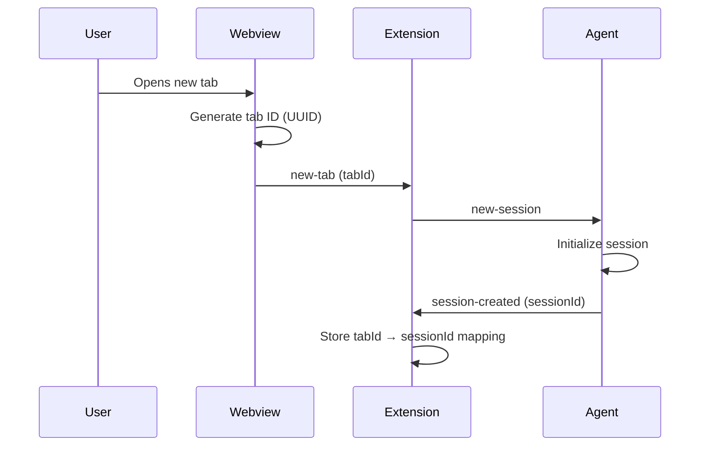
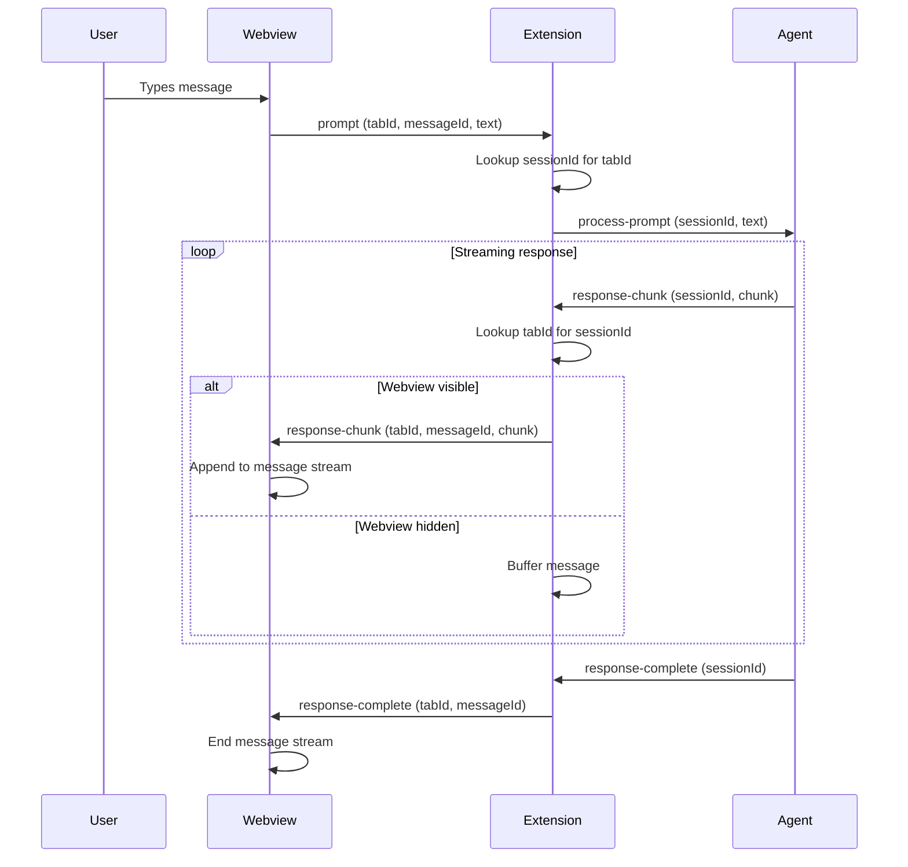
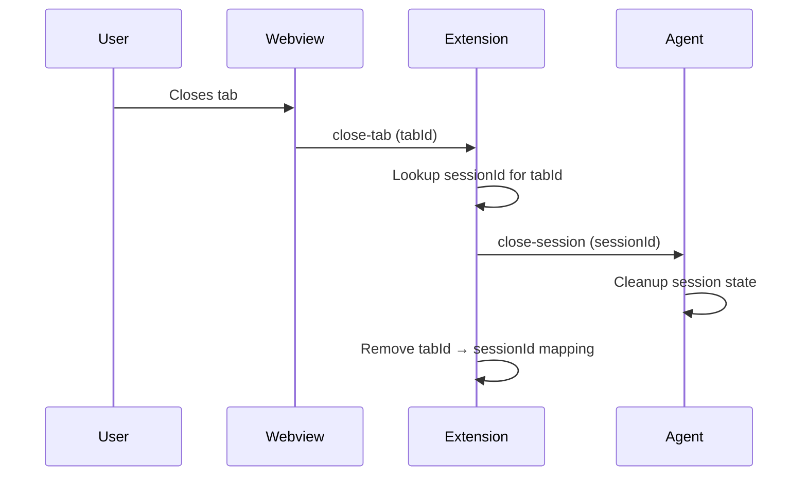

# Message Protocol

The extension coordinates message flow between the webview UI and agent process. Messages are identified by UUIDs and routed based on tab/session mappings.

## Message Identity

The system uses two separate identification mechanisms:

**Message IDs (UUIDs):** Identify specific prompt/response conversations. When a user sends a prompt, the webview generates a UUID message ID. All response chunks for that prompt include the same message ID, allowing the UI to associate chunks with the correct prompt and render them in the right place. Message IDs enable multiple concurrent prompts (user sends prompt in tab A while tab B is still streaming a response).

**Message indices (numbers):** Monotonically increasing integers assigned by the extension per tab, used exclusively for deduplication. When the webview is hidden and shown, the extension may replay messages to ensure nothing was missed. The webview tracks the last index it saw per tab (via `lastSeenIndex` map) and ignores messages with `index <= lastSeenIndex[tabId]`. This prevents duplicate response chunks from appearing in the UI.

**Why both?** Message IDs provide semantic identity ("which conversation is this?"). Message indices provide delivery tracking ("have I seen this before?"). The extension assigns indices sequentially as messages flow through; the webview uses UUIDs for UI routing and indices for deduplication.

## Message Flow Patterns

### Opening a New Tab



**Why UUID generation in webview?** The webview owns tab lifecycle. Generating IDs at the source avoids round-trip coordination with the extension.

**Why separate session IDs?** The agent owns session identity. Tab IDs are UI concepts; session IDs are agent concepts. The extension maps between them without understanding either.

### Sending a Prompt



**Why streaming?** AI responses can take seconds to complete. Streaming provides immediate feedback and allows users to start reading while generation continues.

**Why message IDs?** Multiple prompts can be in flight simultaneously (user sends prompt in tab A while tab B is still receiving a response). Message IDs ensure response chunks are associated with the correct prompt.

**Why buffer when hidden?** VSCode can hide webviews at any time (user switches away, collapses sidebar). Buffering ensures the UI sees all messages when it becomes visible again.

### Closing a Tab



**Why explicit close messages?** Allows agent to clean up resources (free memory, close file handles) rather than leaking session state indefinitely.

## Message Identification Strategy

### Tab IDs
- **Generated by:** Webview (when user creates new tab)
- **Format:** UUID v4
- **Scope:** UI-only concept
- **Lifetime:** From tab creation to tab close

### Session IDs
- **Generated by:** Agent (in response to new-session)
- **Format:** Agent-defined (typically UUID)
- **Scope:** Agent-only concept
- **Lifetime:** From session creation to session close

### Message IDs
- **Generated by:** Webview (when user sends prompt)
- **Format:** UUID v4
- **Scope:** Used by both webview and extension for response routing
- **Lifetime:** From prompt send to response complete

**Why three separate ID spaces?** Each layer owns its identity domain. This avoids coupling and eliminates coordination overhead.

## Bidirectional Mapping

The extension maintains two maps:

```
tabId → sessionId    (for extension → agent messages)
sessionId → tabId    (for agent → extension messages)
```

**Synchronization:** Maps are updated atomically when session creation completes. Both directions always stay consistent.

**Cleanup:** Both mappings are removed when either tab closes or session ends.

## Message Ordering Guarantees

**Within a session:** Agent processes prompts sequentially. A second prompt won't start processing until the first response completes.

**Across sessions:** No ordering guarantees. Tabs are independent. Multiple sessions can stream responses simultaneously.

**Webview messages:** Delivered in order sent, but delivery timing depends on webview visibility. Buffered messages are replayed in order when webview becomes visible.

## Error Handling

**Agent crashes:** Extension detects process exit, notifies all active tabs. Tabs display error state. User can trigger agent restart.

**Webview disposal:** Extension maintains agent sessions. If webview is recreated (VSCode restart), extension can restore tab → session mappings and continue existing sessions.

**Message delivery failure:** If webview is disposed while messages are buffered, messages are discarded. Agent sessions may continue running. Next webview instantiation can restore session state.

## Design Rationale

**Why not request/response?** Streaming responses require continuous message flow, not single request/reply pairs. The protocol is inherently asynchronous.

**Why not share IDs across layers?** Each layer has different lifecycle concerns. Decoupling identity spaces allows independent evolution. Extension acts as impedance matcher between UI tab identity and agent session identity.

**Why buffer in extension instead of agent?** Agent shouldn't need to know about webview lifecycle. Extension handles VSCode-specific concerns (visibility, disposal) to keep agent implementation portable.
