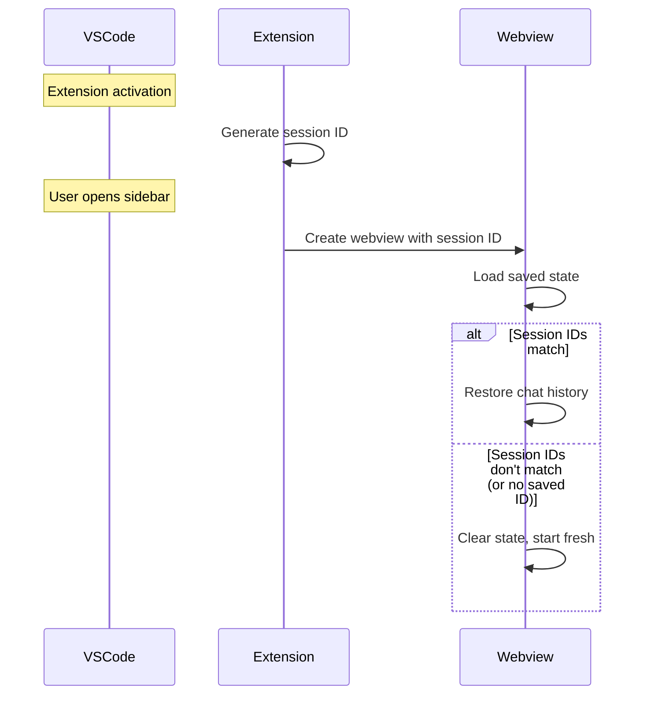

# Webview State Persistence

The webview must preserve chat history and UI state across hide/show cycles, but clear state when VSCode restarts. This requires distinguishing between temporary hiding and permanent disposal.

## The Problem

VSCode webviews face two distinct lifecycle events that look identical from the webview's perspective:

1. **User collapses sidebar** - Webview is hidden but should restore exactly when reopened
2. **VSCode restarts** - Webview is disposed and recreated, should start fresh

Both events destroy and recreate the webview DOM. The webview cannot distinguish between them without additional context.

**User expectation:** Chat history persists within a VSCode session but doesn't carry over to the next session. Draft text should survive sidebar collapse but not VSCode restart.

## Session ID Solution

The extension generates a session ID (UUID) once per VSCode session at activation. This ID is embedded in the webview HTML as a global JavaScript variable (`window.SYMPOSIUM_SESSION_ID`) in a script tag. The webview reads this variable synchronously on load and compares it against the session ID stored in saved state.

**Why this works:**
- Within a session: Same session ID embedded every time, state restores
- After restart: New session ID generated, mismatch detected, state cleared

## State Structure

The webview maintains three pieces of state:

1. **Session ID** - Embedded from extension, used for freshness detection
2. **Last seen index** - Message deduplication tracking (see Webview Lifecycle chapter)
3. **Mynah UI tabs** - Opaque blob from `mynahUI.getAllTabs()` containing tab metadata, chat history, and UI configuration for all open tabs

**Ownership:** Webview owns this state entirely. Extension provides session ID but doesn't read or interpret webview state. The mynah-ui tabs structure is treated as opaque—the webview saves whatever `getAllTabs()` returns and restores it via mynah-ui's initialization config.

**Storage:** VSCode's `getState()`/`setState()` API. Persists across hide/show cycles and VSCode restarts.

## State Lifecycle

### Initial Load

1. Webview reads embedded session ID from `window.SYMPOSIUM_SESSION_ID`
2. Webview calls `vscode.getState()` to load saved state
3. If `savedState.sessionId === window.SYMPOSIUM_SESSION_ID`, restore tabs
4. Otherwise, call `vscode.setState(undefined)` to clear stale state

### During Use

State is saved after any UI change:
- User sends a message
- User opens or closes a tab
- Agent response is received and rendered

**Performance:** VSCode's `setState()` is optimized for frequent calls. No need to debounce or throttle state saves.

### On Restart

1. Extension activation generates new session ID
2. Webview loads with new session ID embedded
3. Session ID mismatch detected (old state has previous session's ID)
4. State cleared, webview starts fresh

## Message Deduplication

When the webview is hidden and shown, the extension may resend messages to ensure nothing was missed. The webview tracks the last message index seen per tab to avoid duplicates.

**Last seen index map:** `{ [tabId: string]: number }`

**Logic:** If incoming message has `index <= lastSeenIndex[tabId]`, ignore it. Otherwise, process and update `lastSeenIndex[tabId]`.

**Why needed?** Extension buffers messages when webview is hidden (see Webview Lifecycle chapter). Replay strategy is "send everything since last known state" rather than tracking exactly which messages were delivered. Webview deduplicates to avoid showing duplicate response chunks.

## Design Trade-offs

### Why not `retainContextWhenHidden`?

VSCode offers `retainContextWhenHidden: true` to keep webview alive when hidden. This would eliminate the need for state persistence entirely.

**Trade-off:** Microsoft documentation warns of "much higher performance overhead." The webview remains in memory consuming resources even when not visible.

**Decision:** Use state persistence for lightweight chat interfaces. Reserve `retainContextWhenHidden` for complex UIs (e.g., embedded IDEs) that cannot be easily serialized.

### Why not global state in extension?

Extension could store chat history in `globalState` instead of webview managing its own state.

**Trade-off:** Violates state ownership principle. Webview understands mynah-ui structure; extension shouldn't need to parse or manipulate UI state.

**Decision:** Webview owns UI state, extension provides coordination (session ID injection). Keeps extension simple and allows mynah-ui to evolve independently.

### Why clear on restart instead of persisting?

Chat history could persist across VSCode restarts using `globalState` or workspace storage.

**Trade-off:** Users expect fresh sessions on restart. Long-lived history creates stale context and memory accumulation. Workspace-specific persistence could be added later if needed.

**Decision:** Session-scoped state matches user expectations and reduces complexity. Each VSCode session starts clean.

## Migration and Compatibility

**Old state without session ID:** Treated as stale, cleared on first load. Ensures smooth upgrade path when session ID feature is added.

**Future state format changes:** Session ID check happens before parsing state structure. Mismatched session ID clears everything, eliminating need for explicit version migration.
