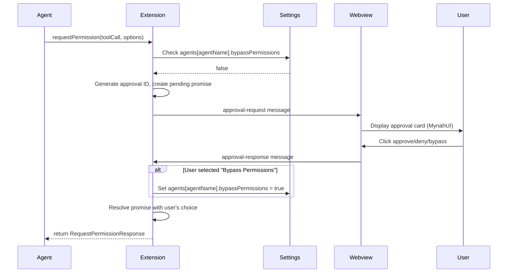
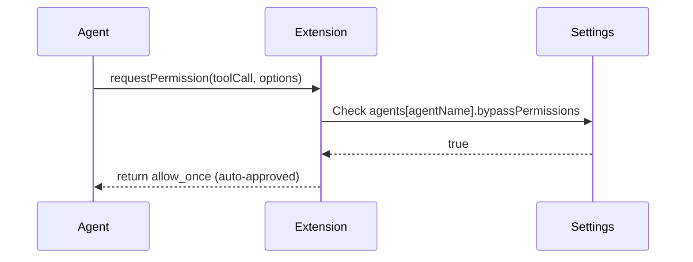

# Tool Use Authorization

When agents request permission to execute tools (file operations, terminal commands, etc.), the extension provides a user approval mechanism. This chapter describes how authorization requests flow through the system and how per-agent policies are enforced.

## Architecture

The authorization flow bridges three layers:

```
Agent (ACP requestPermission) → Extension (Promise-based routing) → Webview (MynahUI approval card)
```

The extension acts as the coordination point:
- Receives synchronous `requestPermission` callbacks from the ACP agent
- Checks per-agent bypass settings
- Routes approval requests to the webview when user input is needed
- Blocks the agent using promises until the user responds

## Authorization Flow

### With Bypass Disabled



### With Bypass Enabled



## Promise-Based Blocking

The ACP SDK's `requestPermission` callback is synchronous - it must return a `Promise<RequestPermissionResponse>`. The extension creates a promise that resolves when the user responds:

```typescript
async requestPermission(params) {
  // Check bypass setting first
  if (agentConfig.bypassPermissions) {
    return { outcome: { outcome: "selected", optionId: allowOptionId } };
  }
  
  // Create promise that will resolve when user responds
  const promise = new Promise((resolve, reject) => {
    pendingApprovals.set(approvalId, { resolve, reject, agentName });
  });
  
  // Send request to webview
  sendToWebview({ type: "approval-request", approvalId, ... });
  
  // Return promise (blocks agent until resolved)
  return promise;
}
```

When the webview sends `approval-response`, the extension resolves the promise:

```typescript
case "approval-response":
  const pending = pendingApprovals.get(message.approvalId);
  pending.resolve(message.response);  // Unblocks agent
```

This allows the agent to block on permission requests without blocking the extension's event loop.

## Per-Agent Settings

Authorization policies are scoped per-agent in `symposium.agents` configuration:

```json
{
  "symposium.agents": {
    "Claude Code": {
      "command": "npx",
      "args": ["@zed-industries/claude-code-acp"],
      "bypassPermissions": true
    },
    "ElizACP": {
      "command": "elizacp",
      "bypassPermissions": false
    }
  }
}
```

**Why per-agent?** Different agents have different trust levels. A user might trust Claude Code with unrestricted file access but want to review every tool call from an experimental agent.

**Scope:** Settings are stored globally (VSCode user settings), so bypass policies persist across workspaces and sessions.

## User Approval Options

When bypass is disabled, the webview displays three options:

- **Approve** - Allow this single tool call, continue prompting for future tools
- **Deny** - Reject this single tool call, continue prompting for future tools
- **Bypass Permissions** - Approve this call AND set `bypassPermissions = true` for this agent permanently

The "Bypass Permissions" option provides a quick path to trusted status without requiring manual settings edits.

## Webview UI Implementation

The webview uses MynahUI primitives to display approval requests:

- **Chat item** - Approval request appears as a chat message in the conversation
- **Buttons** - Three buttons (Approve, Deny, Bypass) using MynahUI's button status colors
- **Tool details** - Tool name, parameters (formatted as JSON), and any available metadata
- **Card dismissal** - Cards auto-dismiss after the user clicks a button (`keepCardAfterClick: false`)

The specific MynahUI API usage is documented in the [MynahUI GUI reference](../../references/mynah-ui-guide.md).

## Approval Request Message

Extension → Webview:

```typescript
{
  type: "approval-request",
  tabId: string,
  approvalId: string,        // UUID for matching response
  agentName: string,          // Which agent is requesting permission
  toolCall: {
    toolCallId: string,       // ACP tool call identifier
    title?: string,           // Human-readable tool name (may be null)
    kind?: ToolKind,          // "read", "edit", "execute", etc.
    rawInput?: object         // Tool parameters
  },
  options: PermissionOption[] // Available approval options from ACP
}
```

## Approval Response Message

Webview → Extension:

```typescript
{
  type: "approval-response",
  approvalId: string,         // Matches approval-request
  response: {
    outcome: {
      outcome: "selected",
      optionId: string        // Which option was chosen
    }
  },
  bypassAll: boolean          // True if "Bypass Permissions" clicked
}
```

## Design Decisions

**Why block the agent?** Tool execution should wait for user consent. Continuing execution while waiting for approval would allow the agent to make progress on non-tool operations, potentially creating race conditions where the user approves a tool call that's no longer relevant.

**Why promise-based?** JavaScript promises provide natural blocking semantics. The extension can return immediately (non-blocking event loop) while the agent perceives the call as synchronous (blocking until approval).

**Why store in settings?** Bypass permissions should persist across sessions. VSCode settings provide durable storage with UI for manual editing if needed.

**Why auto-dismiss cards?** Once the user responds, the approval card is no longer actionable. Dismissing it keeps the conversation history clean and focused on the actual work.

## Future Enhancements

Potential extensions to the authorization system:

- **Per-tool policies** - Trust specific tools (e.g., "always allow Read") while prompting for others
- **Resource-based rules** - Auto-approve file reads within certain directories
- **Temporary sessions** - "Bypass for this session" option that doesn't persist
- **Approval history** - Log of past approvals for security auditing
- **Batch approvals** - Approve multiple pending tool calls at once
