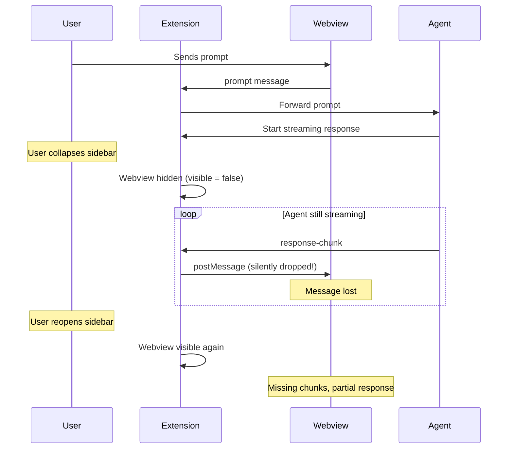
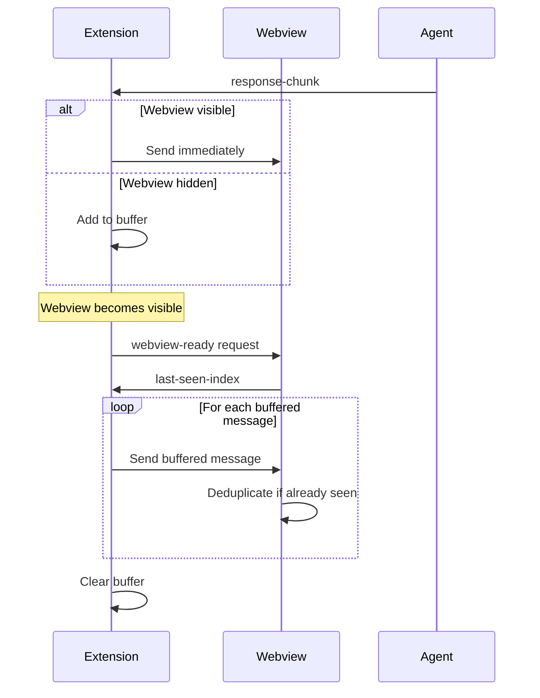
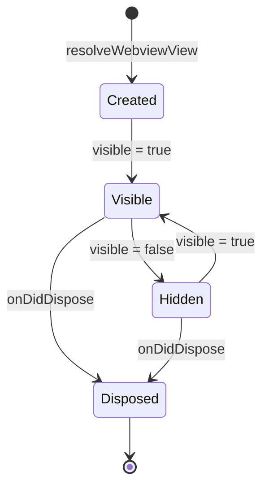

# Webview Lifecycle Management

VSCode can hide and show webviews at any time based on user actions. The extension must handle visibility changes gracefully to ensure no messages are lost and the UI appears responsive when shown.

## Visibility States

A webview has three lifecycle states from the extension's perspective:

1. **Visible** - User can see the webview, messages can be delivered immediately
2. **Hidden** - Webview exists but is not visible (sidebar collapsed, tab not focused)
3. **Disposed** - Webview destroyed, no communication possible

**Key constraint:** Hidden webviews cannot receive messages. Attempting to send via `postMessage` succeeds (no error) but messages are silently dropped.

## The Hidden Webview Problem

**Without buffering:** Messages sent while webview is hidden are lost. When user reopens the sidebar, they see incomplete responses or missing messages entirely.

## Message Buffering Strategy

The extension tracks webview visibility and buffers messages when hidden:

**Buffer contents:** Any message destined for the webview (response chunks, completion signals, error notifications).

**Buffer lifetime:** From webview hidden to webview shown. Cleared after replay.

**Replay strategy:** Send all buffered messages in order. Webview uses last-seen-index tracking (see State Persistence chapter) to ignore duplicates.

## Visibility Detection

The extension monitors visibility using VSCode's `onDidChangeViewState` event:

**Event timing:**
- `onDidChangeViewState` fires when `visible` property changes
- `onDidDispose` fires after webview is destroyed (too late for cleanup)

**Race condition:** Messages can arrive between "webview created" and "webview visible." Extension treats created-but-not-visible as hidden state and buffers messages.

## Webview-Ready Handshake

When the webview becomes visible (including initial creation), it announces readiness:

1. **Webview finishes initialization** - DOM loads, webview script executes, session ID is checked, state is restored or cleared, mynah-ui is constructed with restored tabs (if any)
2. **Webview sends `webview-ready`** - After mynah-ui initialization completes, webview sends message to extension including current last-seen-index map
3. **Extension replays buffered messages** - Extension sends any messages that accumulated while webview was hidden
4. **Extension resumes normal message delivery** - New messages are sent immediately as they arrive

**Why handshake?** Webview needs time to initialize mynah-ui and restore state. Sending messages immediately after visibility change could arrive before UI is ready to process them. The webview signals when it's actually ready to receive messages rather than the extension guessing based on visibility events.

**Why include last-seen-index?** Allows extension to avoid resending messages the webview already processed before hiding. Reduces redundant replay.

**What triggers webview-ready?** The webview sends this message during its initialization script, after the mynah-ui constructor completes and before setting up event handlers. On subsequent hide/show cycles, if mynah-ui remains initialized, the webview can send webview-ready immediately after becoming visible.

## Agent Independence

The agent continues running regardless of webview visibility:

- Prompts sent while webview is hidden are still processed
- Responses generated while webview is hidden are buffered
- Sessions remain active across webview hide/show cycles

**Why?** Agent should not need to know about VSCode-specific concerns. Extension insulates agent from webview lifecycle complexity.

**Trade-off:** Long-running agent operations may complete while webview is hidden, buffering large amounts of data. If webview remains hidden for extended periods, memory usage grows. Current implementation has no buffer size limit.

## Disposal Handling

When the webview is disposed (user closes sidebar permanently, workspace switch), buffered messages are discarded:

- Buffer is cleared
- Agent sessions continue running
- Next webview creation can restore tab → session mappings

**Why not save buffered messages?** Messages are ephemeral rendering updates. State persistence (see State Persistence chapter) handles durable state. Buffering is purely a delivery mechanism for real-time updates.

## Design Rationale

**Why buffer in extension instead of agent?** Webview lifecycle is VSCode-specific. Agent shouldn't need VSCode-specific logic. Extension handles UI framework concerns.

**Why replay all messages instead of tracking delivered?** Simpler implementation. Webview deduplication is cheap (index comparison). Tracking exactly which messages were delivered requires more complex state management.

**Why not queue in webview?** Webview is destroyed/recreated when hidden in some cases. Can't rely on webview maintaining queue across lifecycle events. Extension has stable lifecycle tied to VSCode session.

**Why immediate send when visible?** Minimize latency. Users expect real-time streaming responses. Buffering only when necessary provides best UX.
