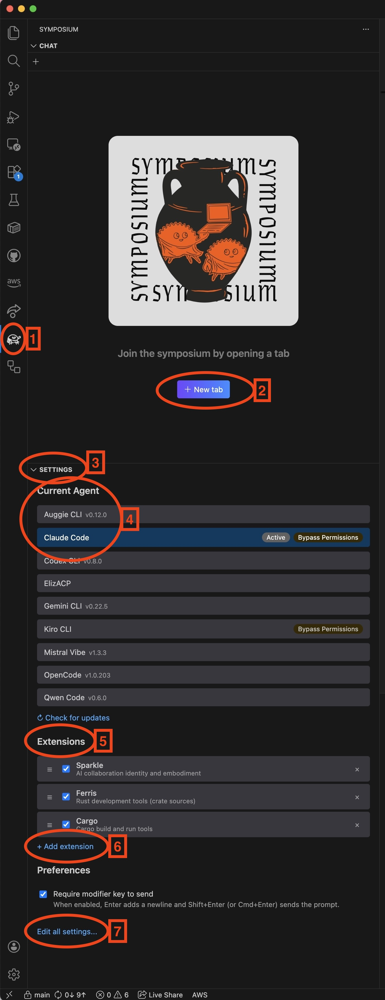

# VSCode and VSCode-based editors

## Step 1: Install the extension

Install the Symposium extension from:

- [VS Code Marketplace](https://marketplace.visualstudio.com/items?itemName=symposium-dev.symposium)
- [Open VSX Registry](https://open-vsx.org/extension/symposium/symposium)

## Step 2: Activate the panel and start chatting

1. **Activity bar icon** — Click to open the Symposium panel
2. **New tab** — Start a new conversation with the current settings
3. **Settings** — Expand to configure agent and extensions
4. **Agent selector** — Choose which agent to use (Claude Code, Gemini CLI, etc.)
5. **Extensions** — Enable MCP servers that add capabilities to your agent
6. **Add extension** — Add custom extensions
7. **Edit all settings** — Access full settings

